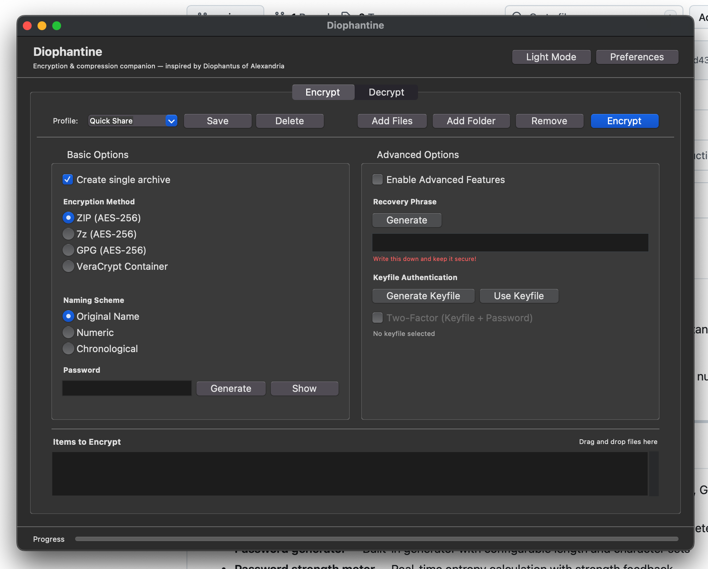

# Diophantine

Local desktop app for file encryption and decryption using existing, audited tools.

Diophantine is a Python/Tkinter GUI that orchestrates:
- `7z` for ZIP/7z encryption
- `gpg` for symmetric GPG encryption
- `veracrypt` for encrypted containers

No cloud services, no accounts, no telemetry.

## Screenshot


## Features

- Encrypt with ZIP (AES-256), 7z (AES-256 + header encryption), GPG symmetric (AES-256), VeraCrypt container
- Decrypt with auto type detection (`.zip`, `.7z`, `.gpg/.pgp/.asc`, `.hc/.tc`)
- Batch operations and drag-and-drop support
- Password generator and entropy meter
- Optional advanced auth modes: recovery phrase, keyfile, keyfile + password
- Profiles for saving encryption settings
- Light/dark support on macOS and themed cross-platform UI

## Requirements

- Python 3.10+
- `tkinter` (usually included with Python desktop installs)
- Python package:
  - `tkinterdnd2>=0.3.0`

System tools:
- Required for core archive encryption/decryption: `7z` or `7zz`
- Optional: `gpg`
- Optional: `veracrypt`

## Install

```bash
git clone https://github.com/tsevis/diophantine.git
cd diophantine
pip install -r requirements.txt
```

### Tool installation examples

macOS (Homebrew):
```bash
brew install p7zip
brew install gnupg
# veracrypt installed manually from veracrypt.fr
```

Ubuntu/Debian:
```bash
sudo apt update
sudo apt install p7zip-full gnupg python3-tk
```

Fedora:
```bash
sudo dnf install p7zip p7zip-plugins gnupg2 python3-tkinter
```

## Run

```bash
cd src
python main.py
```

## Quick Usage

1. Open `Encrypt` tab.
2. Add files/folders.
3. Choose method and naming scheme.
4. Enter password (or advanced auth mode).
5. Encrypt to output folder.

For decryption:
1. Open `Decrypt` tab.
2. Add encrypted files.
3. Confirm/override detected type.
4. Enter matching auth input.
5. Decrypt to output folder.

Full user guide: [`MANUAL.md`](MANUAL.md)

## Security Notes

- Diophantine does not implement custom crypto; it shells out to external tools.
- Security depends on endpoint integrity and password strength.
- Keep `7z/gpg/veracrypt` updated.
- Verify encrypted output before deleting plaintext originals.

Additional docs:
- [`docs/SECURITY.md`](docs/SECURITY.md)
- [`docs/THREAT_MODEL.md`](docs/THREAT_MODEL.md)
- [`docs/PHILOSOPHY.md`](docs/PHILOSOPHY.md)

## License

MIT (see [`LICENSE`](LICENSE)).
